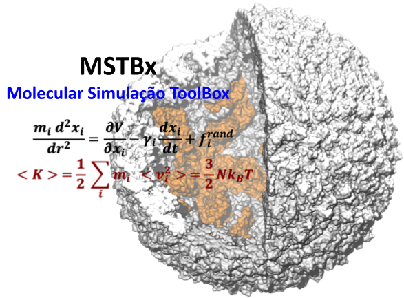

<p align="center">
  
</p>

<h1 align="center">MSTBx : Molecular Simulação ToolBox</h1>

<p align="center" style="font-size:1.3em;">
  <b>🌐 Select your language | Escolha seu idioma | Elige tu idioma</b>
</p>

<p align="center">
  <a href="#pt-br"></a>
  &nbsp;&nbsp;
  <a href="#en"></a>
  &nbsp;&nbsp;
  <a href="#es"></a>
</p>

<p align="center" style="font-size:1.1em;">
  <i>
    Click a flag to jump to your language.<br>
    Clique em uma bandeira para ir ao seu idioma.<br>
    Haz clic en una bandera para ir a tu idioma.
  </i>
</p>

---

## <a id="pt-br"></a>🇧🇷 Português

<p align="center" style="font-size:1.1em;">
  <b>MSTBx</b> é um pacote <i>in house</i> para preparar e gerar arquivos de configuração para simulações de dinâmica molecular de moléculas em solução ou membrana.<br>
  <b>Compatível com NAMD2 e NAMD3</b>.<br>
  <i>Foco em sistemas grandes, usando PSFGen e VMD.</i>
</p>

<details open>
<summary><b>Leia mais em Português</b></summary>

### ✨ Visão Geral

<p align="justify">
O MSTBx permite preparar sistemas para dinâmica molecular de forma eficiente, especialmente para sistemas grandes (milhões de átomos), aproveitando o poder do PSFGen e VMD. Atualmente, suporta NAMD2 e NAMD3, com planos futuros para GROMACS, AMBER e OpenMM. Métodos como SMD já estão implementados, e ABF, US, GaMD e FEP serão adicionados em breve.<br>
Se tiver dúvidas ou encontrar erros, por favor, abra um <a href="https://github.com/groponp/MSTBx/issues">Issue</a> no GitHub.
</p>

### 🚀 Instalação

```bash
git clone git@github.com:groponp/MSTBx.git 
cd MSTBx/ 

# ⚠️ Atenção: Antes de rodar o comando abaixo, troque o prefix para o caminho do seu conda!
# Exemplo: prefix: /home/SEU_USUARIO/miniconda3/envs/mstbx

conda env create -f mstbx.yml
conda activate mstbx

# Adicione o MSTBx ao seu PATH
rota=$(pwd)
echo "export MSTBx=$rota:\$PATH" >> ~/.zshrc   # Para zsh
echo "export MSTBx=$rota:\$PATH" >> ~/.bashrc  # Para bash

# Ative as variáveis de ambiente
source ~/.zshrc   # ou source ~/.bashrc
```

### 📚 Exemplos de Uso

<details>
<summary><b>Ubiquitina em Solução</b></summary>

1. Crie uma pasta chamada `ubiquitin` para armazenar os arquivos.
2. Use o <b>PDBReader</b> do CHARMM-GUI para gerar os arquivos PSF/PDB (tutorial <a href="https://www.charmm-gui.org/?doc=demo&id=pdb_reader&lesson=1">aqui</a>).
3. Baixe `step1_pdbreader.pdb` e `step1_pdbreader.psf` e coloque-os na pasta.
4. Monte o sistema e gere os arquivos de configuração para NAMD2/NAMD3.

<p align="justify">
O protocolo padrão inclui: NVT (2 ns, restrição em heavy atoms), NPT (5 ns, mesma restrição) e produção NPT (sem restrições). Ajuste o tempo de simulação conforme necessário.
</p>

```bash
mkdir ubiquitin 
conda activate mstbx
python $MSTBx/GenSol.py --help

# Montar o sistema
python $MSTBx/GenSol.py --psf step1_pdbreader.psf \
                        --pdb step1_pdbreader.pdb \
                        --salt 0.150 \
                        --ofile ubq

# Gerar arquivos de configuração
python $MSTBx/GenMDSolConfg.py --psf 01build/ubq.psf \
                               --pdb 01build/ubq.pdb \
                               --temperature 310 \
                               --mdtime 1
```
</details>

<details>
<summary><b>Proteína-Ligante</b></summary>

1. Gere PSF/PDB e parâmetros do ligante com o PDBReader do CHARMM-GUI (<a href="https://www.charmm-gui.org/?doc=demo&id=protein_ligand&lesson=1">tutorial</a>).
2. Baixe os arquivos e coloque-os na pasta.
3. Monte o sistema e adicione os parâmetros do ligante ao gerar os arquivos de configuração.

```bash
mkdir baat 
conda activate mstbx 
python $MSTBx/GenSol.py --help

# Montar o sistema
python $MSTBx/GenSol.py --psf step1_pdbreader.psf \
                        --pdb step1_pdbreader.pdb \
                        --salt 0.150 \
                        --ofile baat 

# Gerar arquivos de configuração (incluindo parâmetros do ligante)
python $MSTBx/GenMDSolConfg.py --psf 01build/baat.psf \
                               --pdb 01build/baat.pdb \
                               --lparm tyl.prm \
                               --temperature 310 \
                               --mdtime 1  
```
</details>

<details>
<summary><b>Tetramero de Aquaporina em Membrana POPC</b></summary>

1. Use o Membrane Builder do CHARMM-GUI (<a href="https://www.charmm-gui.org/?doc=demo&id=membrane_builder&lesson=2">tutorial</a>) para gerar o sistema.
2. Ajuste o tamanho da membrana conforme a extensão da proteína (soma dos valores de X ou Y + 30 Å).
3. Baixe os arquivos `step4_lipid.psf` e `step4_lipid.pdb`.
4. Monte o sistema e gere os arquivos de configuração.

```bash
mkdir aqp 
conda activate mstbx 
python $MSTBx/GenMemb.py --help

# Descompacte e copie os arquivos do CHARMM-GUI
tar -xvzf charmm-gui.tgz
cp charmm-gui-*/step4_lipid.psf  . 
cp charmm-gui-*/step4_lipid.pdb  . 

# Montar o sistema
python $MSTBx/GenMemb.py --psf step4_lipid.psf \
                         --pdb step4_lipid.pdb \
                         --salt 0.150 \
                         --ofile aqp

# Gerar arquivos de configuração
python $MSTBx/GenMDMembConfg.py --psf 01build/aqp.psf \
                                --pdb 01build/aqp.pdb \
                                --temperature 310 \
                                --mdtime 1
```
<p align="justify">
<b>Nota:</b> O MSTBx é muito mais eficiente que o CHARMM-GUI para sistemas grandes. Por exemplo, sistemas como a proteína spike do SARS-CoV-2 podem ser preparados em ~30 min, enquanto no CHARMM-GUI podem levar até 8 horas.
</p>
</details>

</details>

---

## <a id="en"></a>🇺🇸 English

<details>
<summary><b>Read in English</b></summary>

<p align="center" style="font-size:1.1em;">
  <b>MSTBx</b> is an <i>in-house</i> package to prepare and generate configuration files for molecular dynamics simulations of molecules in solution or membrane.<br>
  <b>Compatible with NAMD2 and NAMD3</b>.<br>
  <i>Focus on large systems, using PSFGen and VMD.</i>
</p>

### ✨ Overview

<p align="justify">
MSTBx allows you to efficiently prepare systems for molecular dynamics, especially for large systems (millions of atoms), leveraging the power of PSFGen and VMD. Currently supports NAMD2 and NAMD3, with future plans for GROMACS, AMBER, and OpenMM. Methods like SMD are already implemented, and ABF, US, GaMD, and FEP will be added soon.<br>
If you have questions or find bugs, please open an <a href="https://github.com/groponp/MSTBx/issues">Issue</a> on GitHub.
</p>

### 🚀 Installation

```bash
git clone git@github.com:groponp/MSTBx.git 
cd MSTBx/ 

# ⚠️ Attention: Before running the command below, change the prefix to your conda path!
# Example: prefix: /home/YOUR_USER/miniconda3/envs/mstbx

conda env create -f mstbx.yml
conda activate mstbx

# Add MSTBx to your PATH
rota=$(pwd)
echo "export MSTBx=$rota:\$PATH" >> ~/.zshrc   # For zsh
echo "export MSTBx=$rota:\$PATH" >> ~/.bashrc  # For bash

# Activate environment variables
source ~/.zshrc   # or source ~/.bashrc
```

### 📚 Usage Examples

<details>
<summary><b>Ubiquitin in Solution</b></summary>

1. Create a folder named `ubiquitin` to store the files.
2. Use the <b>PDBReader</b> from CHARMM-GUI to generate the PSF/PDB files (tutorial <a href="https://www.charmm-gui.org/?doc=demo&id=pdb_reader&lesson=1">here</a>).
3. Download `step1_pdbreader.pdb` and `step1_pdbreader.psf` and place them in the folder.
4. Build the system and generate the configuration files for NAMD2/NAMD3.

<p align="justify">
The default protocol includes: NVT (2 ns, restraint on heavy atoms), NPT (5 ns, same restraint), and NPT production (no restraints). Adjust the simulation time as needed.
</p>

```bash
mkdir ubiquitin 
conda activate mstbx
python $MSTBx/GenSol.py --help

# Build the system
python $MSTBx/GenSol.py --psf step1_pdbreader.psf \
                        --pdb step1_pdbreader.pdb \
                        --salt 0.150 \
                        --ofile ubq

# Generate configuration files
python $MSTBx/GenMDSolConfg.py --psf 01build/ubq.psf \
                               --pdb 01build/ubq.pdb \
                               --temperature 310 \
                               --mdtime 1
```
</details>

<details>
<summary><b>Protein-Ligand</b></summary>

1. Generate PSF/PDB and ligand parameters with the PDBReader from CHARMM-GUI (<a href="https://www.charmm-gui.org/?doc=demo&id=protein_ligand&lesson=1">tutorial</a>).
2. Download the files and place them in the folder.
3. Build the system and add the ligand parameters when generating the configuration files.

```bash
mkdir baat 
conda activate mstbx 
python $MSTBx/GenSol.py --help

# Build the system
python $MSTBx/GenSol.py --psf step1_pdbreader.psf \
                        --pdb step1_pdbreader.pdb \
                        --salt 0.150 \
                        --ofile baat 

# Generate configuration files (including ligand parameters)
python $MSTBx/GenMDSolConfg.py --psf 01build/baat.psf \
                               --pdb 01build/baat.pdb \
                               --lparm tyl.prm \
                               --temperature 310 \
                               --mdtime 1  
```
</details>

<details>
<summary><b>Aquaporin Tetramer in POPC Membrane</b></summary>

1. Use the Membrane Builder from CHARMM-GUI (<a href="https://www.charmm-gui.org/?doc=demo&id=membrane_builder&lesson=2">tutorial</a>) to generate the system.
2. Adjust the membrane size according to the protein's extension (sum of X or Y values + 30 Å).
3. Download the `step4_lipid.psf` and `step4_lipid.pdb` files.
4. Build the system and generate the configuration files.

```bash
mkdir aqp 
conda activate mstbx 
python $MSTBx/GenMemb.py --help

# Extract and copy files from CHARMM-GUI
tar -xvzf charmm-gui.tgz
cp charmm-gui-*/step4_lipid.psf  . 
cp charmm-gui-*/step4_lipid.pdb  . 

# Build the system
python $MSTBx/GenMemb.py --psf step4_lipid.psf \
                         --pdb step4_lipid.pdb \
                         --salt 0.150 \
                         --ofile aqp

# Generate configuration files
python $MSTBx/GenMDMembConfg.py --psf 01build/aqp.psf \
                                --pdb 01build/aqp.pdb \
                                --temperature 310 \
                                --mdtime 1
```
<p align="justify">
<b>Note:</b> MSTBx is much more efficient than CHARMM-GUI for large systems. For example, systems like the SARS-CoV-2 spike protein can be prepared in ~30 min with MSTBx, while in CHARMM-GUI it may take up to 8 hours.
</p>
</details>

</details>

---

## <a id="es"></a>🇪🇸 Español

<details>
<summary><b>Leer en Español</b></summary>

<p align="center" style="font-size:1.1em;">
  <b>MSTBx</b> es un paquete <i>in house</i> para preparar y generar archivos de configuración para simulaciones de dinámica molecular de moléculas em solução ou membrana.<br>
  <b>Compatible com NAMD2 y NAMD3</b>.<br>
  <i>Enfocado en sistemas grandes, usando PSFGen y VMD.</i>
</p>

### ✨ Visión Geral

<p align="justify">
MSTBx permite preparar sistemas para dinâmica molecular de forma eficiente, especialmente para sistemas grandes (milhões de átomos), aproveitando o poder de PSFGen e VMD. Atualmente suporta NAMD2 e NAMD3, com planos futuros para GROMACS, AMBER e OpenMM. Métodos como SMD já estão implementados, e ABF, US, GaMD e FEP serão adicionados em breve.<br>
Se tiver dúvidas ou encontrar erros, por favor, abra um <a href="https://github.com/groponp/MSTBx/issues">Issue</a> no GitHub.
</p>

### 🚀 Instalación

```bash
git clone git@github.com:groponp/MSTBx.git 
cd MSTBx/ 

# ⚠️ Atenção: Antes de rodar o comando abaixo, troque o prefix para o caminho do seu conda!
# Exemplo: prefix: /home/SEU_USUARIO/miniconda3/envs/mstbx

conda env create -f mstbx.yml
conda activate mstbx

# Adicione o MSTBx ao seu PATH
rota=$(pwd)
echo "export MSTBx=$rota:\$PATH" >> ~/.zshrc   # Para zsh
echo "export MSTBx=$rota:\$PATH" >> ~/.bashrc  # Para bash

# Ative as variáveis de ambiente
source ~/.zshrc   # ou source ~/.bashrc
```

### 📚 Ejemplos de Uso

<details>
<summary><b>Ubiquitina em Solução</b></summary>

1. Crea una carpeta llamada `ubiquitin` para almacenar los archivos.
2. Usa el <b>PDBReader</b> de CHARMM-GUI para generar los archivos PSF/PDB (tutorial <a href="https://www.charmm-gui.org/?doc=demo&id=pdb_reader&lesson=1">aquí</a>).
3. Descarga `step1_pdbreader.pdb` y `step1_pdbreader.psf` y colócalos en la carpeta.
4. Monta el sistema y genera los archivos de configuración para NAMD2/NAMD3.

<p align="justify">
El protocolo por defecto incluye: NVT (2 ns, restrição em átomos pesados), NPT (5 ns, mesma restrição) e produção NPT (sem restrições). Ajusta el tiempo de simulación según sea necesario.
</p>

```bash
mkdir ubiquitin 
conda activate mstbx
python $MSTBx/GenSol.py --help

# Montar el sistema
python $MSTBx/GenSol.py --psf step1_pdbreader.psf \
                        --pdb step1_pdbreader.pdb \
                        --salt 0.150 \
                        --ofile ubq

# Generar archivos de configuración
python $MSTBx/GenMDSolConfg.py --psf 01build/ubq.psf \
                               --pdb 01build/ubq.pdb \
                               --temperature 310 \
                               --mdtime 1
```
</details>

<details>
<summary><b>Proteína-Ligando</b></summary>

1. Genera los archivos PSF/PDB y los parámetros del ligando con el PDBReader de CHARMM-GUI (<a href="https://www.charmm-gui.org/?doc=demo&id=protein_ligand&lesson=1">tutorial</a>).
2. Descarga los archivos y colócalos en la carpeta.
3. Monta el sistema y añade los parámetros del ligando al generar los archivos de configuración.

```bash
mkdir baat 
conda activate mstbx 
python $MSTBx/GenSol.py --help

# Montar el sistema
python $MSTBx/GenSol.py --psf step1_pdbreader.psf \
                        --pdb step1_pdbreader.pdb \
                        --salt 0.150 \
                        --ofile baat 

# Generar archivos de configuración (incluyendo parâmetros del ligando)
python $MSTBx/GenMDSolConfg.py --psf 01build/baat.psf \
                               --pdb 01build/baat.pdb \
                               --lparm tyl.prm \
                               --temperature 310 \
                               --mdtime 1  
```
</details>

<details>
<summary><b>Tetrámero de Acuaporina em Membrana POPC</b></summary>

1. Usa el Membrane Builder de CHARMM-GUI (<a href="https://www.charmm-gui.org/?doc=demo&id=membrane_builder&lesson=2">tutorial</a>) para generar el sistema.
2. Ajusta el tamaño de la membrana según la extensión de la proteína (suma de los valores de X o Y + 30 Å).
3. Descarga los archivos `step4_lipid.psf` y `step4_lipid.pdb`.
4. Monta el sistema y genera los archivos de configuración.

```bash
mkdir aqp 
conda activate mstbx 
python $MSTBx/GenMemb.py --help

# Descomprime y copia los archivos de CHARMM-GUI
tar -xvzf charmm-gui.tgz
cp charmm-gui-*/step4_lipid.psf  . 
cp charmm-gui-*/step4_lipid.pdb  . 

# Montar el sistema
python $MSTBx/GenMemb.py --psf step4_lipid.psf \
                         --pdb step4_lipid.pdb \
                         --salt 0.150 \
                         --ofile aqp

# Generar archivos de configuración
python $MSTBx/GenMDMembConfg.py --psf 01build/aqp.psf \
                                --pdb 01build/aqp.pdb \
                                --temperature 310 \
                                --mdtime 1
```
<p align="justify">
<b>Nota:</b> MSTBx es mucho más eficiente que CHARMM-GUI para sistemas grandes. Por ejemplo, sistemas como la proteína spike del SARS-CoV-2 pueden prepararse en ~30 min, mientras que en CHARMM-GUI pueden tardar hasta 8 horas.
</p>
</details>

</details>

---

## 👨‍💻 Autor | Author | Autor

<p align="center">
<b>Ropón-Palacios G.</b><br>
Departamento de Física,<br>
Instituto de Biociências, Letras e Ciências Exatas - IBILCE,<br>
Universidade Estadual Paulista "Júlio de Mesquita Filho" - UNESP<br>
Rua Cristóvão Colombo, 2265 - Jardim Nazareth<br>
São José do Rio Preto/SP - CEP 15054-000<br>
E-mail: <a href="mailto:georcki.ropon@unesp.br">georcki.ropon@unesp.br</a>
</p>

---

## 📄 Licença | License | Licencia

<p align="center">
  <a href="https://www.gnu.org/licenses/gpl-3.0.en.html">GPLv3</a>
</p>
