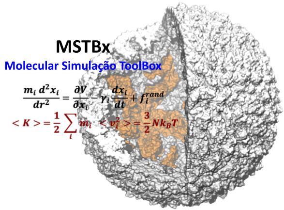

<p align="center">
  
</p>

<h1 align="center">MSTBx : Molecular Simulation ToolBox</h1>

<p align="center" style="font-size:1.3em;">
  <b>🌐 Select your language | Escolha seu idioma | Elige tu idioma</b>
</p>

<p align="center">
  <a href="docs/wiki/pt/Home.md"></a>
  &nbsp;&nbsp;
  <a href="docs/wiki/en/Home.md"></a>
  &nbsp;&nbsp;
  <a href="docs/wiki/es/Home.md"></a>
</p>

<p align="center" style="font-size:1.1em;">
  <i>Click a flag to visit the Wiki and Examples.<br>Clique em uma bandeira para visitar a Wiki e Exemplos.<br>Haz clic en una bandera para visitar la Wiki y Ejemplos.</i>
</p>

---

## ✨ Overview

**MSTBx** is a modular Python package designed to prepare and generate configuration files for molecular dynamics (MD) simulations. It focuses on large systems (millions of atoms) and leverages the power of **VMD**, **PSFGen**, and **MDAnalysis**.

*   **Supported Engines**: NAMD2, NAMD3 (Future support for GROMACS, AMBER, OpenMM).
*   **Key Modules**: `autopsfgen`, `namdinputs`, `pdbwriter`, `colabfold`, `mkdocking-cmplx`.

---

## 🚀 Installation

MSTBx is now a formal Python package. You can install it via `pip` inside a Conda environment to use it globally without modifying your `$PATH`.

### 1. Create Environment
```bash
git clone https://github.com/groponp/MSTBx.git
cd MSTBx/
conda env create -f mstbx.yml
conda activate mstbx
```

### 2. Install Package
```bash
# Install in editable mode
pip install -e .
```

Now you can run the tool from anywhere using:
```bash
mstbx --help
```

---

## 📚 Wiki & Examples

Explore detailed tutorials and examples in your preferred language:

### 🇺🇸 [English Wiki](docs/wiki/en/Home.md)
*   [Protein in Solution](docs/wiki/en/Example_Solvation.md)
*   [Membrane Proteins](docs/wiki/en/Example_Membrane.md)
*   [PDB Repair & Cleaning](docs/wiki/en/Example_PDBWriter.md)

### 🇧🇷 [Wiki em Português](docs/wiki/pt/Home.md)
*   [Proteína em Solução](docs/wiki/pt/Example_Solvation.md)
*   [Proteínas de Membrana](docs/wiki/pt/Example_Membrane.md)
*   [Reparo e Limpeza de PDB](docs/wiki/pt/Example_PDBWriter.md)

### 🇪🇸 [Wiki en Español](docs/wiki/es/Home.md)
*   [Proteína en Solución](docs/wiki/es/Example_Solvation.md)
*   [Proteínas de Membrana](docs/wiki/es/Example_Membrane.md)
*   [Reparación y Limpieza de PDB](docs/wiki/es/Example_PDBWriter.md)

---

## 👨‍💻 Author
**Ropón-Palacios G.**  
UNESP - São José do Rio Preto/SP  
Email: [georcki.ropon@unesp.br](mailto:georcki.ropon@unesp.br)

## 📄 License
[GPLv3](https://www.gnu.org/licenses/gpl-3.0.en.html)
