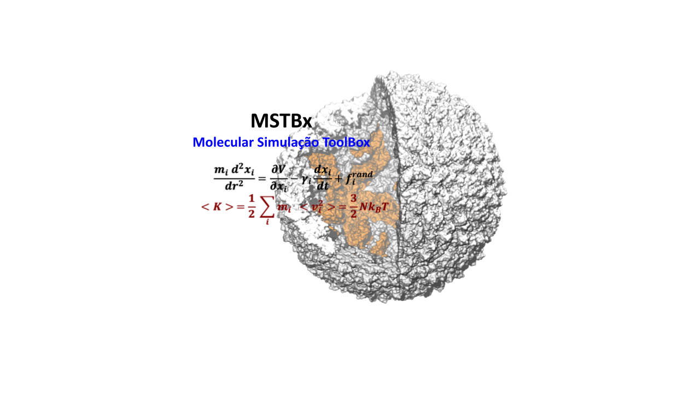

# MSTBx: Molecular Simulation ToolBox (v0.8.9-beta)

<p align="center">
  
</p>

## Introduction

<p align="justify">
MSTBx is a high-performance, modular Python-based ecosystem designed to streamline the preparation, configuration, and execution of Molecular Dynamics (MD) simulations. Built with a "Waiter/Chef" architecture, MSTBx provides a unified Command Line Interface (CLI) that automates complex tasks involving VMD, PSFGen, and MDAnalysis.
</p>

<p align="justify">
While web-based system builders are convenient, they often struggle with massive systems or complex high-throughput requirements. MSTBx is engineered for efficiency, capable of preparing systems with millions of atoms (such as the SARS-CoV-2 Spike protein) in a fraction of the time required by conventional tools. It offers an <b>excellent synergy with the CHARMM-GUI PDBReader</b>: users can generate initial topology/coordinates (PSF/PDB) via CHARMM-GUI and then leverage MSTBx's speed for rapid solvation, ionization, and protocol generation. Furthermore, MSTBx is highly versatile and can process PSF/PDB files generated by any other standard modeling tools.
</p>

## Core Philosophies

<p align="justify">
1. <b>Efficiency</b>: Optimized for large-scale complexes where automation is critical.<br>
2. <b>Reproducibility</b>: Parameter-driven configuration ensures consistent protocol generation.<br>
3. <b>Engine Versatility</b>: Native support for NAMD 2/3. We are actively working to expand support for <b>AMBER, GROMACS, and OpenMM</b> in future releases.<br>
4. <b>Standardization</b>: Enforces strict geometric symmetries and nomenclature across all modules.
</p>

---

## Installation

### 1. Environment Management (Conda)
<p align="justify">
It is highly recommended to use a dedicated environment to isolate dependencies (Python >= 3.12):
</p>

```bash
conda create -n mstbx python=3.12
conda activate mstbx

git clone git@github.com:groponp/MSTBx.git
cd MSTBx
pip install -e .
```

### 2. Persistent Shell Completion
<p align="justify">
To enable robust TAB completion for all MSTBx modules, add the following to your `~/.zshrc` (or `~/.bashrc`):
</p>

```bash
# MSTBx CLI Completion
eval "$(_MSTBX_COMPLETE=zsh_source $HOME/miniconda3/envs/mstbx/bin/mstbx)"
```

---

## Module Reference and Technical Documentation

### 1. `topopsfgen` - System Assembly and Solvation

<p align="justify">
The `topopsfgen` module is the primary engine for building CHARMM-style PSF/PDB structures. It handles solvation, ionization, and complex environment assembly (membranes/SMD). It is designed to work seamlessly with initial outputs from the <b>CHARMM-GUI PDBReader</b>, providing a significant speed advantage for subsequent building steps.
</p>

**Technical Details:**
- **Solvation**: Implements cubic or square-XY padding. Default padding is 18.0 Å for solution systems.
- **Ionization**: Uses a randomized placement algorithm to achieve the target ionic strength (Default: 0.150 M NaCl).
- **Membrane**: Aligns the protein within a lipid bilayer (POPC/others) with default 25.0 Å Z-padding.

**Example: Ubiquitin in Water**
Based on the `testing/ubiquitin` validation set:
```bash
mstbx topopsfgen --env solution \
                 --psf step1_pdbreader.psf \
                 --pdb step1_pdbreader.pdb \
                 --salt 0.150 \
                 --padding 18.0 \
                 --ofile ubq_solvated
```
*Logic*: This command reads the initial PSF/PDB (prepared via CHARMM-GUI PDBReader), adds an 18 Å water buffer in all directions, and ionizes to 150 mM NaCl. Output files will be prefixed with `ubq_solvated`.

### 2. `md-inputs` - Protocol Generation

<p align="justify">
This module generates production-ready configuration files for different simulation engines. It standardizes the Minimization, NVT (Equilibration), NPT (Pressurization), and Production phases.
</p>

**Parameters and Defaults:**
- `--engine`: [namd|amber|gromacs|openmm].
- `--temperature`: Target temperature in Kelvin (Default: 310 K).
- `--mdtime`: Production run time in nanoseconds (Default: 100 ns).
- `--dcdfreq`: Trajectory frame saving frequency in picoseconds (Default: 10.0 ps).

**Example: Protein-Ligand Complex (BAAT)**
Based on the `testing/baat` validation set:
```bash
mstbx md-inputs --engine namd \
                --env solution \
                --psf 01build/baat.psf \
                --pdb 01build/baat.pdb \
                --lparm tyl.prm \
                --temperature 310 \
                --mdtime 100 \
                --dcdfreq 20.0
```
*Logic*: Generates a NAMD protocol for a protein-ligand system. Note the use of `--lparm` to include the specific ligand parameter file (`tyl.prm`). The output includes a step-by-step pipeline (Minimization -> NVT -> NPT -> Production).

### 3. `smd-inputs` - Steered Molecular Dynamics

<p align="justify">
`smd-inputs` configures velocity-based pulling simulations. It calculates the necessary NAMD Colvars or engine-specific pulling parameters.
</p>

**Key Flags:**
- `--selpull`: VMD selection for the pulling group (e.g., "resname LIG").
- `--selanchor`: VMD selection for the fixed/anchor group (e.g., "protein and backbone").
- `--velocity`: Constant pulling speed in Å/ns (Default: 10.0 Å/ns).
- `--target-center`: Maximum extension distance in Å.

**Example: Pulling Validation**
Based on the `testing/smd` validation set:
```bash
mstbx smd-inputs --psf system.psf \
                 --pdb system.pdb \
                 --selpull "resname LIG" \
                 --selanchor "protein and backbone" \
                 --target-center 50.0 \
                 --velocity 5.0 \
                 --temperature 310
```
*Logic*: This prepares a protocol to pull a ligand 50 Å away from the binding site at a slow velocity of 5 Å/ns to minimize non-equilibrium artifacts.

### 4. `metad-inputs` - Well-Tempered Metadynamics

<p align="justify">
This module streamlines the configuration of enhanced sampling via <b>Well-Tempered Metadynamics</b> using the NAMD Colvars module. It automates the generation of Gaussian hill parameters and bias scaling.
</p>

**Parameters:**
- `--sel1` & `--sel2`: VMD selections for the two groups defining the distance Collective Variable (CV). (e.g., "segid PROA" and "segid PROB").
- `--hill`: Initial hill height in kcal/mol (Default: 0.1).
- `--width`: Hill width/Sigma (Default: 0.5 Å).
- `--biasT`: Bias temperature for well-tempered scaling (Default: 4000 K).
- `--biasfactor`: Also known as the <i>Delta T</i> factor; it controls the rate at which the hill height decays.

**Example:**
```bash
mstbx metad-inputs --psf complex.psf \
                   --pdb complex.pdb \
                   --sel1 "segid PROA" \
                   --sel2 "segid PROB" \
                   --target-distance 30.0 \
                   --hill 0.2 \
                   --biasT 4000 \
                   --mdtime 500
```
*Logic*: Configures a distance CV between segments A and B. MSTBx generates the `colvars.in` file automatically, setting up the Well-Tempered deposition frequency and Gaussian parameters for a 500 ns run.

### 5. `pdbwriter` - Structure Refinement and CRD Generation

<p align="justify">
Advanced preparation tool for repairing, annotating, and converting coordinate files. It integrates PDBFixer for gap filling, PDB2PQR for protonation, and can generate highly compatible CHARMM-GUI extended `.crd` files.
</p>

**Capabilities:**
- `--fix`: Repairs missing atoms and internal residues.
- `--ph`: Sets target pH for protonation (e.g., `--ph 7.4`).
- `--ssbond`: Heuristic detection of disulfide bridges.
- `--write-ext-crd`: Generates an extended CHARMM-GUI style `.crd` file, retaining high-precision coordinates and matching the exact fixed-width column specifications. Requires both `--input` and `--psf`.
- `--check-mol-format`: Validates the integrity of coordinate and topology files (PDB, PSF, CRD, MOL2). Use with `--mol`. This check is also performed internally whenever `pdbwriter` generates an output file.

**Examples:**
```bash
# Refine and fix a PDB file
mstbx pdbwriter -i raw.pdb -o refined.pdb --fix --ph 7.4 --ssbond

# Generate an extended CHARMM-GUI compatible CRD file
mstbx pdbwriter --psf step3_input.psf -i step3_input.pdb --write-ext-crd -o step3_input.crd

# Validate a file format (PDB, PSF, CRD, or MOL2)
mstbx pdbwriter --mol system.psf --check-mol-format
```

### 6. `resetpsf` - X-PLOR Format Conversion

<p align="justify">
Essential for systems with complex patches (glycans, virtual atoms, or CMAP) that require the X-PLOR PSF format. It safely converts standard CHARMM-GUI structures while preserving system integrity. The module automatically parses and verifies that the `!NATOM` counts perfectly match the input architecture to prevent silent data loss during VMD translations.
</p>

**Example:**
```bash
mstbx resetpsf --psf charmm.psf --pdb charmm.pdb -o system_xplor
```

### 7. `md-translate` - Engine Interoperability

<p align="justify">
Allows the conversion of NAMD-formatted systems (PSF/COOR/XSC) to other engine formats like GROMACS (TOP/GRO).
</p>

**Example:**
```bash
mstbx md-translate --psf system.psf \
                   --coor system.coor \
                   --xsc system.xsc \
                   --toppar-dir ./toppar \
                   --target gromacs
```

---

## Development Standards

<p align="justify">
MSTBx follows strict internal standards to ensure reliability:
- <b>Logging</b>: All output is timestamped: `[LEVEL HH:MM:SS DD/MM/YYYY]`.
- <b>Naming</b>: Consistent flags across all modules (`--env`, `--engine`, `--psf`, `--pdb`).
- <b>Safety</b>: Automated box symmetry checks to prevent periodic boundary condition artifacts.
</p>

## Author
**Ropón-Palacios G.**  
Department of Physics, UNESP.  
[georcki.ropon@unesp.br](mailto:georcki.ropon@unesp.br)

## License
MSTBx is licensed under the **MIT License**.
