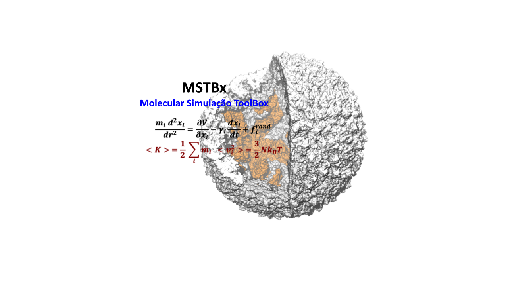

# MSTBx: Molecular Simulation ToolBox (v0.8.10-beta)

<p align="center">
  
</p>

## Introduction

<p align="justify">
MSTBx is a high-performance, modular Python-based ecosystem designed to streamline the preparation, configuration, and execution of Molecular Dynamics (MD) simulations. Built with a "Waiter/Chef" architecture, MSTBx provides a unified Command Line Interface (CLI) that automates complex tasks involving VMD, PSFGen, and MDAnalysis.
</p>

<p align="justify">
While web-based system builders are convenient, they often struggle with massive systems or complex high-throughput requirements. MSTBx is engineered for efficiency, capable of preparing systems with millions of atoms (such as the SARS-CoV-2 Spike protein) in a fraction of the time required by conventional tools. It offers an <b>excellent synergy with the CHARMM-GUI PDBReader</b>: users can generate initial topology/coordinates (PSF/PDB) via CHARMM-GUI and then leverage MSTBx's speed for rapid solvation, ionization, and protocol generation. Furthermore, MSTBx is highly versatile and can process PSF/PDB files generated by any other standard modeling tools.
</p>

## Core Philosophies

<p align="justify">
1. <b>Efficiency</b>: Optimized for large-scale complexes where automation is critical.<br>
2. <b>Reproducibility</b>: Parameter-driven configuration ensures consistent protocol generation.<br>
3. <b>Engine Versatility</b>: Native support for NAMD 2/3, GROMACS, and OpenMM, with AMBER planned.<br>
4. <b>Standardization</b>: Enforces strict geometric symmetries and nomenclature across all modules.
</p>

---

## Installation

### 1. Environment Management (Conda)
<p align="justify">
Use the repository Conda recipe to install MSTBx together with the executable tools required by the validated GROMACS workflows (Python >= 3.12):
</p>

```bash
conda env create -f environment.yml
conda activate mstbx
```

For a fresh checkout, the equivalent commands are:

```bash
conda create -n mstbx python=3.12 pip
conda activate mstbx
pip install -e ".[test]"
```

The Conda recipe installs `gromacs`, `openbabel`, OpenMM, PDBFixer, MDAnalysis,
MDTraj, and the Python package. `gromacs` and `obabel` are external executables,
not Python modules, so a Python-only `pip install` does not provide them.

Verify the installation:

```bash
mstbx --help
gmx --version
obabel -V
python -m pytest
```

VMD/NAMD and Apptainer are optional external programs for the corresponding
workflows. Install them through the provider or cluster module system and verify
them separately:

```bash
vmd -dispdev text -eofexit
namd2 --version
apptainer --version
```

The GROMACS force field and CGenFF converter are packaged inside the Python
wheel. The CHARMM-GUI/CGenFF Web service remains a manual external step.

### 2. Persistent Shell Completion
<p align="justify">
To enable robust TAB completion for all MSTBx modules, add the following to your `~/.zshrc` (or `~/.bashrc`):
</p>

```bash
# MSTBx CLI Completion
eval "$(_MSTBX_COMPLETE=zsh_source $HOME/miniconda3/envs/mstbx/bin/mstbx)"
```

---

## 📚 Complete Step-by-Step Examples & Minitutorials

Navigate directly to each workflow tutorial using the hyperlinks below:
- [0. PDBWriter Structure Preparation](#0-pdbwriter-structure-preparation)
- [1. Ubiquitin in Solution](#1-ubiquitin-in-solution)
- [2. Protein-Ligand Complex (BAAT)](#2-protein-ligand-complex-baat)
- [3. Aquaporin Tetramer in POPC Membrane](#3-aquaporin-tetramer-in-popc-membrane)
- [4. Steered Molecular Dynamics (SMD) Pulling](#4-steered-molecular-dynamics-smd-pulling)
- [5. Glycosylated Protein Simulation (1OAN Dimer)](#5-glycosylated-protein-simulation-1oan-dimer)
- [6. Automated OpenMM Runner Pipeline (Chignolin)](#6-automated-openmm-runner-pipeline-chignolin)
- [7. GROMACS Protein-Only](#7-gromacs-protein-only)
- [8. GROMACS Protein-Ligand with CGenFF](#8-gromacs-protein-ligand-with-cgenff)
- [9. Docking Pose to a Protein-Ligand System](#9-docking-pose-to-a-protein-ligand-system)

---

### 0. PDBWriter Structure Preparation
Use `pdbwriter` as the first structure-quality step before `topopsfgen` or `topogmx`. The normal practice is to repair missing heavy atoms and strictly internal residues, then let the selected simulation engine add hydrogens. Do not add hydrogens with PDBFixer before `pdb2gmx` unless that is explicitly required by a separate workflow.

1. **Inspect all options and defaults**:
   ```bash
   mstbx pdbwriter --help
   ```
   The input coordinate file is supplied with `--input`/`-i`; `--output`/`-o` is the output file or directory. Use `--pdb-id` instead of `--input` when the official RCSB record should be downloaded internally. With only `--pdb-id`, PDBWriter downloads `<pdb-id>.pdb` to the current directory; use `--output` to choose another path and `--overwrite` to replace it. `--select-chains` accepts comma-separated chain IDs and is applied during download as well.
2. **Download a PDB without processing it**:
   ```bash
   mstbx pdbwriter --pdb-id 1AKI
   mstbx pdbwriter --pdb-id 1AKI --output input/1aki.pdb --overwrite
   ```
   The first form only downloads the official RCSB PDB file and does not run PDBFixer or protonation.
3. **Repair a local structure**:
   ```bash
   mstbx pdbwriter \
     --input raw.pdb \
     --output prepared.pdb \
     --fix-structure \
     --select-chains A \
     --internal-only
   ```
   `--internal-only` is the safe default: terminal gaps are not rebuilt automatically. For an official structure with SEQRES, download and repair it directly:
   ```bash
   mstbx pdbwriter \
     --pdb-id 1UBQ \
     --output 1ubq_fixed.pdb \
     --fix-structure \
     --select-chains A
   ```
4. **Select a protein and ligand without fixing the structure**:
   ```bash
   mstbx pdbwriter \
     --input complex.pdb \
     --select-atoms "protein or resname X" \
     --output protein_ligand.pdb
   ```
   This uses MDAnalysis directly. For PDB chain identifiers, use the MDAnalysis keyword `chainID`, and use `name` for atom-name patterns:
   ```bash
   mstbx pdbwriter \
     --input complex.pdb \
     --select-atoms "chainID A B and not name H*" \
     --output heavy_atoms.pdb
   ```
   `--select-atoms` does not call PDBFixer, so selected HETATM records remain available. An empty or invalid MDAnalysis selection stops with an error.
   To assign CHARMM segment IDs, use one value for all segments or one comma-separated value per segment:
   ```bash
   mstbx pdbwriter \
     --input bc.pdb \
     --segid PROB,PROC \
     --output bc_charmm.pdb
   ```
5. **Repair while preserving ligands, waters, or ions**:
   ```bash
   mstbx pdbwriter \
     --pdb-id 2OI0 \
     --output 2oi0_fixed.pdb \
     --fix-structure \
     --fix-keep-hetatoms \
     --select-chains A
   ```
   Use `--fix-keep-hetatoms` before ligand extraction. Without it, PDBFixer removes HETATM records by default. Use `--fix-add-hydrogens` only when the downstream workflow requires PDBFixer-generated hydrogens:
   ```bash
   mstbx pdbwriter \
     --input raw.pdb \
     --output prepared_ph74.pdb \
     --fix-structure \
     --fix-add-hydrogens \
     --pH 7.4
   ```
6. **Request pH/force-field nomenclature and disulfide detection**:
   ```bash
   mstbx pdbwriter \
     --input prepared.pdb \
     --output annotated.pdb \
     --pH 7.4 \
     --ff-out CHARMM \
     --ssbond
   ```
   `--ff-out` accepts `CHARMM` or `AMBER`. With `CHARMM`, PDB2PQR runs with CHARMM input/output naming and applies PROPKA titration states. `--ssbond` detects close CYS SG pairs and writes SSBOND records. Review the generated report and the structure before simulation.
7. **Apply chain, residue, and segment edits**:
   ```bash
   mstbx pdbwriter \
     --input prepared.pdb \
     --output edited.pdb \
     --rename-chain A:B \
     --rename-chain C:D \
     --renumber 1 \
     --segid PROT
   ```
   `--rename-chain` may be repeated, `--renumber` sets the starting residue number, and `--segid` sets the segment identifier.
8. **Generate and validate an extended CHARMM CRD**:
   ```bash
   mstbx pdbwriter \
     --input step3_input.pdb \
     --psf step3_input.psf \
     --output step3_input.crd \
     --write-ext-crd

   mstbx pdbwriter \
     --mol step3_input.crd \
     --check-mol-format
   ```
   `--mol` is validation input only and must be combined with `--check-mol-format`. The same validator accepts PDB, PSF, CRD, and MOL2 files.
9. **Prepare CGenFF Web inputs**:
   ```bash
   mstbx pdbwriter \
     --prepare-cgenff-inputs \
     --pdb-id 2OI0 \
     --select-chains A \
     --pdb-ligand-resname 283 \
     --pdb-ligand-chain A \
     --output cgenff_inputs_2oi0 \
     --ligand-pH 7.4 \
     --overwrite
   ```
   For an external ligand PDB, replace the source ligand selectors with `--ligand ligand_pose.pdb`. `--ligand-pH` controls Open Babel MOL2 preparation and defaults to 7.4. Upload the generated MOL2 manually to CGenFF Web and save the returned STR separately.

After this tutorial, use `input/prepared.pdb` or the corresponding edited output as the `--protein` input for `topogmx`. If a local PDB has no SEQRES, prefer `--pdb-id` for reliable internal-gap detection.

---

### 1. Ubiquitin in Solution
A complete workflow starting from standard CHARMM-GUI PDBReader outputs to assemble and generate NAMD protocols for a protein in water.

1. **Workspace Setup**: Create a folder named `ubiquitin` and place `step1_pdbreader.pdb` and `step1_pdbreader.psf` inside.
2. **System Assembly**: Solvate the protein and add 0.150 M NaCl salt with an 18 Å padding:
   ```bash
   mstbx topopsfgen --env solution \
                    --psf step1_pdbreader.psf \
                    --pdb step1_pdbreader.pdb \
                    --salt 0.150 \
                    --padding 18.0 \
                    --ofile ubq
   ```
3. **Protocol Generation**: Generate standard NAMD simulation configuration files for 100 ns at 310 K:
   ```bash
   mstbx md-inputs --engine namd \
                   --env solution \
                   --psf 01build/ubq.psf \
                   --pdb 01build/ubq.pdb \
                   --temperature 310 \
                   --mdtime 100
   ```

---

### 2. Protein-Ligand Complex (BAAT)
Configure molecular dynamics for a protein bound to a small molecule ligand, incorporating external parameter files.

1. **Workspace Setup**: Create a folder named `baat` and gather complex files `step1_pdbreader.pdb`, `step1_pdbreader.psf`, and the ligand parameter stream/parameter file `tyl.prm`.
2. **System Assembly**: Solvate and ionize the complex system:
   ```bash
   mstbx topopsfgen --env solution \
                    --psf step1_pdbreader.psf \
                    --pdb step1_pdbreader.pdb \
                    --salt 0.150 \
                    --ofile baat
   ```
3. **Protocol Generation**: Generate NAMD configurations, specifying the path to the ligand parameters (`--lparm`):
   ```bash
   mstbx md-inputs --engine namd \
                   --env solution \
                   --psf 01build/baat.psf \
                   --pdb 01build/baat.pdb \
                   --lparm tyl.prm \
                   --temperature 310 \
                   --mdtime 100
   ```

---

### 3. Aquaporin Tetramer in POPC Membrane
Build and simulate a large membrane protein system using CHARMM-GUI Membrane Builder inputs.

1. **Workspace Setup**: Create a folder named `aqp` and extract your membrane builder coordinates/topology (`step4_lipid.psf` and `step4_lipid.pdb`).
2. **System Assembly**: Assemble the system with lipids and correct water/ion buffers:
   ```bash
   mstbx topopsfgen --env membrane \
                    --psf step4_lipid.psf \
                    --pdb step4_lipid.pdb \
                    --salt 0.150 \
                    --ofile aqp
   ```
3. **Protocol Generation**: Generate membrane-specific NAMD equilibration and production inputs:
   ```bash
   mstbx md-inputs --engine namd \
                   --env membrane \
                   --psf 01build/aqp.psf \
                   --pdb 01build/aqp.pdb \
                   --temperature 310 \
                   --mdtime 100
   ```

---

### 4. Steered Molecular Dynamics (SMD) Pulling
Assemble and configure pulling simulations to pull a ligand out of a binding pocket along the Z axis.

1. **System Assembly**: Solvate the system while adding extra space along the pulling direction (Z axis):
   ```bash
   mstbx topopsfgen --env smd \
                    --psf complex.psf \
                    --pdb complex.pdb \
                    --atoms-pull "resname LIG" \
                    --atoms-anchor "protein and backbone" \
                    --extra-space 50 \
                    --ofile smd_sys
   ```
2. **Protocol Generation**: Configure the pulling velocity (e.g. 5 Å/ns) and anchors:
   ```bash
   mstbx smd-inputs --psf 01build/smd_sys.psf \
                    --pdb 01build/smd_sys.pdb \
                    --selpull "resname LIG" \
                    --selanchor "protein and backbone" \
                    --target-center 50.0 \
                    --velocity 5.0
   ```

---

### 5. Glycosylated Protein Simulation (1OAN Dimer)
A robust workflow to handle glycosylated systems by converting topology/coordinates first before system assembly.

1. **PSF Reset**: Convert the raw initial structures (e.g. `step1_pdbreader` from CHARMM-GUI) to X-PLOR format to support glycan structures:
   ```bash
   mstbx resetpsf --psf step1_pdbreader.psf \
                  --pdb step1_pdbreader.pdb \
                  --output reset
   ```
2. **System Assembly**: Solvate and ionize the reset structures using `topopsfgen`:
   ```bash
   mstbx topopsfgen --env solution \
                    --psf reset.psf \
                    --pdb reset.pdb \
                    --salt 0.150 \
                    --ofile mol
   ```
3. **Protocol Generation**: Generate the simulation configuration files for the solvated system:
   ```bash
   mstbx md-inputs --engine namd \
                   --env solution \
                   --psf 01build/mol.psf \
                   --pdb 01build/mol.pdb
   ```

---

### 6. Automated OpenMM Runner Pipeline (Chignolin)
A complete step-by-step example using `openmm-run` to execute minimization, multi-stage equilibration, and microsecond-scale production.

1. **System Assembly & Prep**: Place your topology and coordinates files (e.g., `01build/mol_chignolin.psf` and `01build/mol_chignolin.pdb`) in the workspace.
2. **Generate Templates**: Automatically generate the input protocol configuration files (`eq1.inp`, `eq2.inp`, `prod.inp`):
   ```bash
   mstbx openmm-run --mk-inp
   ```
3. **Unified Equilibration (Step 1)**: Run minimization and NVT equilibration (2 ns) using the generated `02eq1/eq1.inp`:
   ```bash
   mstbx openmm-run -i 02eq1/eq1.inp \
                    -p 01build/mol_chignolin.psf \
                    -c 01build/mol_chignolin.pdb \
                    -orst 02eq1/eq1 \
                    --ns 2.0
   ```
4. **NPT Pressurization (Step 2)**: Continue the simulation to run NPT equilibration (5 ns), passing the restart file (`02eq1/eq1.rst`):
   ```bash
   mstbx openmm-run -i 03eq2/eq2.inp \
                    -p 01build/mol_chignolin.psf \
                    -c 01build/mol_chignolin.pdb \
                    -irst 02eq1/eq1.rst \
                    -orst 03eq2/eq2 \
                    --ns 5.0
   ```
5. **NPT Production Run (Step 3)**: Continue to production dynamics (1000 ns / 1 μs) with automatic coordinate rewrapping enabled:
   ```bash
   mstbx openmm-run -i 04prod/prod.inp \
                    -p 01build/mol_chignolin.psf \
                    -c 01build/mol_chignolin.pdb \
                    -irst 03eq2/eq2.rst \
                    -orst 04prod/prod \
                    --ns 1000.0 \
                    --rewrap
   ```

---

### 7. GROMACS Protein-Only
A complete GROMACS workflow for a protein without a ligand. This path does not use CGenFF, ligand files, or ligand restraints.

1. **Prepare the protein**:
   ```bash
   cd mstbx/testing/gromacs-protein
   mkdir -p input
   mstbx pdbwriter \
     --fix-structure \
     --pdb-id 1UBQ \
     --select-chains A \
     --output input/protein_prepared.pdb
   ```
   If a local PDB is used and contains missing heavy atoms or internal residues, repair it first:
   ```bash
   mstbx pdbwriter \
     --input raw_protein.pdb \
     --fix-structure \
     --select-chains A \
     --output input/protein_prepared.pdb
   ```
   Use an official RCSB structure with SEQRES when possible. Do not use `--fix-add-hydrogens`; `pdb2gmx` adds CHARMM36 hydrogens in the next step. Review terminal gaps manually instead of rebuilding them automatically.
2. **Build, solvate, and ionize the system**:
   ```bash
   mstbx topogmx \
     --protein input/protein_prepared.pdb \
     --output-dir runs \
     --box-distance 1.8 \
     --pdb2gmx-ter \
     --pdb2gmx-selection $'0\n0\n' \
     --gmx gmx \
     --overwrite
   ```
3. **Generate minimization, NVT, NPT, production, index, restraints, and runner files**:
   If interactive protonation produced CHARMM names such as `LSN` (the
   `LYSN` state), do not use `protein` alone in a custom MDAnalysis selection.
   Use the explicit compatibility selection below:
   ```bash
   PROTEIN_SEL='(protein or resname ARGN ARGN1 ARGN2 ARGN3 ASPH ASPP CYS2 GLUH GLUP HISD HIS1 HISE HISH HSD HSE HSP HSPM LYSN LSN)'
   ```
   ```bash
   mstbx md-inputs --engine gromacs \
     --env solution \
     --runs-dir runs \
     --temperature 310 \
     --nvt-time 2 \
     --npt-time 5 \
     --mdtime 1 \
     --xtc-frequency 50 \
     --name-group-index-1 Protein \
     --select-group-index-1 "$PROTEIN_SEL" \
     --name-group-index-2 Water_and_ions \
     --select-group-index-2 "not ($PROTEIN_SEL)" \
     --select-atoms-to-restraint "$PROTEIN_SEL and name N CA C O" \
     --gmx gmx
   ```
4. **Inspect and run**:
   ```bash
   find runs -maxdepth 2 -type f | sort
   cd runs
   ./run_all.sh
   ```

The default output has `01build`, `02nvt`, `03npt`, `04md`, `restraints`, `toppar`, and `run_all.sh`. The validation example uses 50,000 EM steps, 2 ns NVT, 5 ns NPT, 1 ns production, a 2 fs timestep, and XTC frames every 50 ps.

**Interactive protonation variant:** use this case when the protonation state
of HIS, ASP, GLU, LYS, or ARG must be selected residue by residue. Run the
command in a terminal and answer every `pdb2gmx` prompt; do not pipe the
non-interactive `--pdb2gmx-selection` input into this variant because that
input only covers terminal choices:

```bash
mstbx topogmx \
  --protein input/protein_prepared.pdb \
  --output-dir runs_interactive \
  --box-distance 1.8 \
  --pdb2gmx-ter \
  --pdb2gmx-protonation \
  --gmx gmx \
  --overwrite
```

The prompts first ask for N-terminal and C-terminal states and then show the
available protonation states for titratable residues. Record the choices in the
run log and inspect the resulting total charge in `runs_interactive/01build`
before generating MD inputs. Use the non-interactive selection form only after
those choices have been intentionally recorded and tested for the same protein.

### 8. GROMACS Protein-Ligand with CGenFF
A complete GROMACS workflow for a protein-ligand system. MSTBx prepares the files for CGenFF Web, the user obtains the STR manually, and only then does `topogmx` build the solvated system.

1. **Prepare inputs for CGenFF Web**:
   ```bash
   cd mstbx/testing/gromacs-2oi0
   mkdir -p work/cgenff_inputs_2oi0
   mstbx pdbwriter --prepare-cgenff-inputs \
     --pdb-id 2OI0 \
     --select-chains A \
     --pdb-ligand-resname 283 \
     --pdb-ligand-chain A \
     --output work/cgenff_inputs_2oi0 \
     --ligand-pH 7.4 \
     --overwrite
   ```
   If the protein has missing heavy atoms or internal residues, repair it before this extraction and preserve the ligand:
   ```bash
   mstbx pdbwriter \
     --fix-structure \
     --fix-keep-hetatoms \
     --pdb-id 2OI0 \
     --select-chains A \
     --output work/2oi0_fixed.pdb
   ```
   In that case, replace `--pdb-id 2OI0` in the preparation command with `--input work/2oi0_fixed.pdb`. Do not use `--fix-add-hydrogens`; `pdb2gmx` handles protein hydrogens later. Upload `work/cgenff_inputs_2oi0/ligand_for_cgenff.mol2`, do not select `Include parameters that are already in CGenFF`, and save the downloaded result as `work/cgenff_inputs_2oi0/ligand_for_cgenff.str`. This manual web step cannot be automated by MSTBx.
2. **Build the 2OI0 system** after the STR is present:
   ```bash
   mstbx topogmx \
     --protein work/cgenff_inputs_2oi0/protein_prepared.pdb \
     --ligand-mol2 work/cgenff_inputs_2oi0/ligand_for_cgenff.mol2 \
     --ligand-str work/cgenff_inputs_2oi0/ligand_for_cgenff.str \
     --ligand-resname LIG \
     --output-dir runs \
     --box-distance 1.8 \
     --pdb2gmx-ter \
     --pdb2gmx-selection $'1\n1\n'
   ```
   **Interactive residue-protonation variant:** if HIS, ASP, GLU, LYS, or ARG
   states must be chosen manually, use a new output directory and answer the
   terminal prompts directly:
   ```bash
   mstbx topogmx \
     --protein work/cgenff_inputs_2oi0/protein_prepared.pdb \
     --ligand-mol2 work/cgenff_inputs_2oi0/ligand_for_cgenff.mol2 \
     --ligand-str work/cgenff_inputs_2oi0/ligand_for_cgenff.str \
     --ligand-resname LIG \
     --output-dir runs_interactive \
     --box-distance 1.8 \
     --pdb2gmx-ter \
     --pdb2gmx-protonation \
     --gmx gmx \
     --overwrite
   ```
   Do not pipe `--pdb2gmx-selection` into this variant. That option only
   supplies N-terminal and C-terminal answers; `--pdb2gmx-protonation` adds
   residue-by-residue HIS/ASP/GLU/LYS/ARG prompts. The ligand is not
   protonated by `pdb2gmx`; its protonation must be fixed before the CGenFF Web
   submission and kept consistent with the returned STR.
3. **Write protocols, index, restraints, and runner**: NVT and NPT times are given in ns, following the same time convention used by the NAMD tutorials.
   ```bash
   PROTEIN_SEL='(protein or resname ARGN ARGN1 ARGN2 ARGN3 ASPH ASPP CYS2 GLUH GLUP HISD HIS1 HISE HISH HSD HSE HSP HSPM LYSN LSN)'
   SOLUTE_SEL="($PROTEIN_SEL) or resname LIG"
   mstbx md-inputs --engine gromacs \
     --env solution \
     --runs-dir runs \
     --temperature 310 \
     --nvt-time 2 \
     --npt-time 5 \
     --mdtime 100 \
     --xtc-frequency 50 \
     --name-group-index-1 Protein_ligand \
     --select-group-index-1 "$SOLUTE_SEL" \
     --name-group-index-2 Water_and_ions \
     --select-group-index-2 "not ($SOLUTE_SEL)" \
     --select-atoms-to-restraint "$PROTEIN_SEL and name N CA C O or resname LIG and not name H*" \
     --gmx gmx
   ```
4. **Inspect and run the system later**:
   ```bash
   cd runs
   ./run_all.sh
   ```

Create replicas only after the system is validated by copying the full directory, for example `cp -a runs rep1`, `cp -a runs rep2`, and `cp -a runs rep3`. MSTBx deliberately does not manage replicas internally.

The repository scripts under `mstbx/testing/gromacs-2oi0/` validate this same sequence, but the tutorial intentionally shows each command explicitly.

### 9. Docking Pose to a Protein-Ligand System

Every tutorial follows the same rule: explain the starting files, identify the
case in which the workflow applies, show commands in execution order, state
what each command creates, and finish with validation and failure cases. Use
the case-study guide for docking at
[`mstbx/testing/mkdocking/README.md`](mstbx/testing/mkdocking/README.md).

Use `mkdocking-cmplx` to combine a receptor with a docking pose. It accepts
either a PDBQT result or an already converted ligand PDB, and exactly one
ligand source is required:

```bash
mstbx mkdocking-cmplx \
  --protein receptor_prepared.pdb \
  --dock vina_out.pdbqt \
  --pH 7.4 \
  --output complex_pose1.pdb

mstbx mkdocking-cmplx \
  --protein receptor_prepared.pdb \
  --ligand-pdb ligand_pose.pdb \
  --pH 7.4 \
  --output complex_pose1.pdb
```

For PDBQT, `MODEL 1` is used and the pose is converted with Open Babel. The
ligand is normalized to residue `LIG` and chain `L`. The command writes a
combined PDB only; it does not create a PSF, topology, or ligand parameters.

Clean and validate the complex with PDBWriter using an MDAnalysis selection:

```bash
mstbx pdbwriter --input complex_pose1.pdb \
  --select-atoms "protein or resname LIG" \
  --ssbond --segid PROT,LIG \
  --output complex_prepared.pdb --overwrite
mstbx pdbwriter --mol complex_prepared.pdb --check-mol-format
```

For GROMACS, prepare the CGenFF inputs, upload the MOL2 manually to the CGenFF
web service, save the returned STR file, and then run `topogmx`:

```bash
mstbx pdbwriter --prepare-cgenff-inputs \
  --input complex_prepared.pdb --ligand LIG \
  --output cgenff_inputs --ligand-pH 7.4 --overwrite
printf '0\n0\n' | mstbx topogmx \
  --protein cgenff_inputs/protein_prepared.pdb \
  --ligand-mol2 cgenff_inputs/ligand_for_cgenff.mol2 \
  --ligand-str cgenff_inputs/ligand_for_cgenff.str \
  --ligand-resname LIG --forcefield-dir charmm36.ff \
  --box-distance 1.8 --pdb2gmx-ter --output-dir runs --overwrite
```

For NAMD, obtain a PSF with the same atom order as `complex_prepared.pdb` and
matching ligand CHARMM parameters, then use `topopsfgen` and `md-inputs`.
The complete docking workflow and common errors are documented in
[`mstbx/testing/mkdocking/README.md`](mstbx/testing/mkdocking/README.md).

### Project-wide testing

The testing policy applies to every MSTBx workflow, including the existing NAMD, GROMACS, OpenMM, structure preparation, PSF/system construction, docking, translation, enhanced-sampling, and container modules. Each maintained workflow must have:

- unit tests for pure logic, parsers, defaults, and generated files;
- regression tests for validated command order, file layout, and protocol constants;
- adversarial tests for malformed input, invalid option combinations, missing metadata, incomplete selections, and unavailable external tools.

Run the complete automated suite from the repository root:

```bash
pip install -e ".[test]"
python -m pytest
```

The suite validates all registered CLI commands, defaults, supported and
unsupported option combinations, and core input-generation behavior without
launching long MD simulations. Engine-specific command-order tests and
reproducible examples remain under `mstbx/testing/`. When the external tools
are installed, run the short PDB2PQR/GROMACS regressions explicitly:

```bash
MSTBX_PDB2PQR="$(command -v pdb2pqr)" \
MSTBX_GMX="$(command -v gmx)" \
python -m pytest -m external -q
```

The external GROMACS test compiles EM, NVT, NPT, and production TPR inputs
with `grompp`; it does not call `mdrun`.

Use `--pdb2gmx-protonation` only when explicit HIS/ASP/GLU/LYS/ARG protonation choices are required. Otherwise, `pdb2gmx` uses its force-field defaults.

---

## 🔄 Version History

Track key updates and features added in each version of MSTBx compared to previous releases:

*   **`v0.8.10-beta` (Current Version)**:
    *   **GROMACS CHARMM/CGenFF Workflow**: Added `topogmx` for topology/system construction and `md-inputs --engine gromacs` for protocol, index, restraint, and runner generation.
    *   **OpenMM Integration**: Implemented the `openmm-run` command to run strict manual OpenMM runner simulations locally.
    *   **Tutorial Overhaul**: Added full step-by-step minitutorials in `README.md` with interactive anchor hyperlinks.
    *   **Testing Relocation**: Moved the `testing/` directory to `mstbx/testing/` to package all development validation assets inside the module.
    *   **Local Skills**: Created local `.gemini/` development skills to enforce code quality and version history updates.
*   **`v0.8.9-beta`**:
    *   **PDBWriter Refactoring**: Renamed `--pdb` to `--mol` and enforced strict formatting/validation rules.
    *   **Format Validation**: Added `--check-mol-format` to support validation of PDB, PSF, CRD, and MOL2 file structures.
    *   **CRD Extended Support**: Added extended CHARMM-GUI CRD generation support.
*   **`v0.8.5-beta`**:
    *   **Runner Script**: Added automatic `runner.sh` script generation to execute multi-stage equilibration and MD production steps in NAMD.
    *   **Standardized Logging**: Enforced strict timestamped logging across all commands.
*   **`v0.5.0-beta` (Legacy)**:
    *   Added first protein-ligand complex assembly pipelines (`mkdocking-cmplx`) and metadynamics protocol files creator.

---

## Development Standards

<p align="justify">
MSTBx follows strict internal standards to ensure reliability:
- <b>Logging</b>: All output is timestamped: `[LEVEL HH:MM:SS DD/MM/YYYY]`.
- <b>Documentation</b>: All README documentation must be written in English.
- <b>Naming</b>: Consistent flags across all modules (`--env`, `--engine`, `--psf`, `--pdb`).
- <b>Safety</b>: Automated box symmetry checks to prevent periodic boundary condition artifacts.
- <b>Local Development Skill</b>: Standards are checked locally by the `mstbx-development` skill.
</p>

### Testing Policy

Every workflow change must be covered by:

- **Unit tests** for pure logic, CLI contracts, constants, and file writers.
- **Regression tests** for validated layouts, defaults, packaged data, and command architecture.
- **Adversarial tests** for malformed inputs, missing metadata, empty or overlapping selections, and unsafe repair conditions.

Run the automated suite with:

```bash
python -m pytest tests
```

Workflow examples that are too heavy for the automated suite live in `mstbx/testing/<workflow>/` and must stop before long MD production unless the test explicitly targets runtime execution.

## Module Reference and Technical Documentation

### Engine Architecture

MSTBx keeps topology/system construction separate from protocol generation:

| Engine | Topology/system builder | Standard MD inputs | Runner |
| --- | --- | --- | --- |
| NAMD | `topopsfgen` | `md-inputs --engine namd` | generated NAMD runner |
| GROMACS | `topogmx` | `md-inputs --engine gromacs` | generated `run_all.sh` |
| AMBER | `topotleap` | planned `md-inputs --engine amber` | planned |
| OpenMM | CHARMM-style inputs or translated systems | planned `md-inputs --engine openmm` | `openmm-run` |

This keeps `topo*` commands responsible for topology/system generation and `md-inputs` responsible for engine-specific equilibration and production inputs.

### 1. `topopsfgen` - System Assembly and Solvation

<p align="justify">
The `topopsfgen` module is the primary engine for building CHARMM-style PSF/PDB structures. It handles solvation, ionization, and complex environment assembly (membranes/SMD). It is designed to work seamlessly with initial outputs from the <b>CHARMM-GUI PDBReader</b>, providing a significant speed advantage for subsequent building steps.
</p>

**Technical Details:**
- **Solvation**: Implements cubic or square-XY padding. Default padding is 18.0 Å for solution systems.
- **Ionization**: Uses a randomized placement algorithm to achieve the target ionic strength (Default: 0.150 M NaCl).
- **Membrane**: Aligns the protein within a lipid bilayer (POPC/others) with default 25.0 Å Z-padding.

**Example: Ubiquitin in Water**
Based on the `testing/ubiquitin` validation set:
```bash
mstbx topopsfgen --env solution \
                 --psf step1_pdbreader.psf \
                 --pdb step1_pdbreader.pdb \
                 --salt 0.150 \
                 --padding 18.0 \
                 --ofile ubq_solvated
```
*Logic*: This command reads the initial PSF/PDB (prepared via CHARMM-GUI PDBReader), adds an 18 Å water buffer in all directions, and ionizes to 150 mM NaCl. Output files will be prefixed with `ubq_solvated`.

### 2. `md-inputs` - Protocol Generation

<p align="justify">
This module generates production-ready configuration files for different simulation engines. It standardizes the Minimization, NVT (Equilibration), NPT (Pressurization), and Production phases.
</p>

**Parameters and Defaults:**
- `--engine`: [namd|amber|gromacs|openmm].
- `--temperature`: Target temperature in Kelvin (Default: 310 K).
- `--mdtime`: Production run time in nanoseconds (Default: 100 ns).
- `--dcdfreq`: Trajectory frame saving frequency in picoseconds (Default: 10.0 ps).

**Example: Protein-Ligand Complex (BAAT)**
Based on the `testing/baat` validation set:
```bash
mstbx md-inputs --engine namd \
                --env solution \
                --psf 01build/baat.psf \
                --pdb 01build/baat.pdb \
                --lparm tyl.prm \
                --temperature 310 \
                --mdtime 100 \
                --dcdfreq 20.0
```
*Logic*: Generates a NAMD protocol for a protein-ligand system. Note the use of `--lparm` to include the specific ligand parameter file (`tyl.prm`). The output includes a step-by-step pipeline (Minimization -> NVT -> NPT -> Production).

### 2b. `topogmx` and `md-inputs --engine gromacs` - GROMACS CHARMM/CGenFF Workflow

<p align="justify">
These commands prepare GROMACS systems while preserving the same MSTBx directory nomenclature used by the NAMD solution workflow: `01build`, `02nvt`, `03npt`, `04md`, `restraints`, and `toppar`. The minimization MDP is written inside `01build` so the stage layout remains consistent across engines.
</p>

**Generated layout:**
```text
runs/
  01build/      # topology, coordinates, ionized.gro, em.mdp, index.ndx
  02nvt/        # nvt.mdp
  03npt/        # npt.mdp
  04md/         # md.mdp
  restraints/   # copied position-restraint files
  toppar/       # copied ligand topology/parameters when present
  run_all.sh    # complete GROMACS execution script
```

**Important defaults:**
- `--box-distance`: 1.8 nm.
- `--ligand-resname`: `LIG`.
- EM minimization: 50,000 steps.
- NVT: 2 ns at 2 fs, matching the NAMD solution protocol scheme.
- NPT: 5 ns at 2 fs.
- Production: 100 ns by default.
- XTC writing frequency: 50 ps.
- Default restraint force: 2092 kJ mol-1 nm-2, equivalent to 5 kcal mol-1 A-2.
- Default restrained atoms: protein backbone heavy atoms plus ligand heavy atoms.
- Default CHARMM/CGenFF force field: packaged `charmm36-feb2026_cgenff-5.0.ff`.
- Default CGenFF converter: packaged `cgenff_charmm2gmx_py3.py`.

### Protonation and selection consistency

- Add `--pdb2gmx-protonation` when HIS, ASP, GLU, LYS, or ARG states must be
  selected interactively. Run `topogmx` in a terminal and answer all prompts.
- `--pdb2gmx-selection` supplies only N-terminal and C-terminal answers; it
  does not replace the residue-protonation prompts.
- CHARMM36 may write `LSN` for the neutral `LYSN` state, along with aliases
  such as `ARGN`, `ASPP`, `GLUP`, `HSD`, `HSE`, and `HSP`. MDAnalysis does not
  classify every alias as `protein`, so use the documented `PROTEIN_SEL` when
  custom groups or restraints follow interactive protonation.
- In protein-ligand systems, define `SOLUTE_SEL` as
  `($PROTEIN_SEL) or resname LIG`, and define the solvent/ion group as
  `not ($SOLUTE_SEL)`. Keep the ligand restraint branch as
  `resname LIG and not name H*`.
- Ligand protonation is decided before CGenFF Web submission. Do not expect
  `pdb2gmx` to change the protonation state of the CGenFF ligand.
- After building, inspect the generated `topol.top`, `ionized.gro`, index
  groups, restraint files, and total charge before running `md-inputs` or
  `mdrun`.

**Protein-only example:**
```bash
mstbx topogmx \
  --protein protein_prepared.pdb \
  --output-dir runs \
  --box-distance 1.8 \
  --pdb2gmx-ter \
  --pdb2gmx-selection $'1\n1\n' \
  --gmx gmx

mstbx md-inputs --engine gromacs \
  --env solution \
  --runs-dir runs \
  --temperature 310 \
  --nvt-time 2 \
  --npt-time 5 \
  --mdtime 1 \
  --xtc-frequency 50 \
  --name-group-index-1 Protein_ligand \
  --select-group-index-1 "protein or resname LIG" \
  --name-group-index-2 Water_and_ions \
  --select-group-index-2 "not (protein or resname LIG)" \
  --select-atoms-to-restraint "protein and backbone or resname LIG and not name H*" \
  --gmx gmx
```

**Protein-ligand CGenFF example:**
```bash
mstbx topogmx \
  --protein cgenff_inputs_2oi0/protein_prepared.pdb \
  --ligand-mol2 cgenff_inputs_2oi0/ligand_for_cgenff.mol2 \
  --ligand-str cgenff_inputs_2oi0/ligand_for_cgenff.str \
  --ligand-resname LIG \
  --output-dir runs \
  --box-distance 1.8 \
  --pdb2gmx-ter \
  --pdb2gmx-selection $'1\n1\n' \
  --gmx gmx \
  --overwrite

mstbx md-inputs --engine gromacs \
  --env solution \
  --runs-dir runs \
  --temperature 310 \
  --nvt-time 2 \
  --npt-time 5 \
  --mdtime 100 \
  --xtc-frequency 50 \
  --name-group-index-1 Protein_ligand \
  --select-group-index-1 "protein or resname LIG" \
  --name-group-index-2 Water_and_ions \
  --select-group-index-2 "not (protein or resname LIG)" \
  --select-atoms-to-restraint "protein and backbone or resname LIG and not name H*" \
  --gmx gmx
```

To run the prepared system later:
```bash
cd runs
./run_all.sh
```

To create independent replicas, copy the complete `runs` directory after validation, for example `cp -a runs rep1`, `cp -a runs rep2`, and `cp -a runs rep3`.

### 3. `smd-inputs` - Steered Molecular Dynamics

<p align="justify">
`smd-inputs` configures velocity-based pulling simulations. It calculates the necessary NAMD Colvars or engine-specific pulling parameters.
</p>

**Key Flags:**
- `--selpull`: VMD selection for the pulling group (e.g., "resname LIG").
- `--selanchor`: VMD selection for the fixed/anchor group (e.g., "protein and backbone").
- `--velocity`: Constant pulling speed in Å/ns (Default: 10.0 Å/ns).
- `--target-center`: Maximum extension distance in Å.

**Example: Pulling Validation**
Based on the `testing/smd` validation set:
```bash
mstbx smd-inputs --psf system.psf \
                 --pdb system.pdb \
                 --selpull "resname LIG" \
                 --selanchor "protein and backbone" \
                 --target-center 50.0 \
                 --velocity 5.0 \
                 --temperature 310
```
*Logic*: This prepares a protocol to pull a ligand 50 Å away from the binding site at a slow velocity of 5 Å/ns to minimize non-equilibrium artifacts.

### 4. `metad-inputs` - Well-Tempered Metadynamics

<p align="justify">
This module streamlines the configuration of enhanced sampling via <b>Well-Tempered Metadynamics</b> using the NAMD Colvars module. It automates the generation of Gaussian hill parameters and bias scaling.
</p>

**Parameters:**
- `--sel1` & `--sel2`: VMD selections for the two groups defining the distance Collective Variable (CV). (e.g., "segid PROA" and "segid PROB").
- `--hill`: Initial hill height in kcal/mol (Default: 0.1).
- `--width`: Hill width/Sigma (Default: 0.5 Å).
- `--biasT`: Bias temperature for well-tempered scaling (Default: 4000 K).
- `--biasfactor`: Also known as the <i>Delta T</i> factor; it controls the rate at which the hill height decays.

**Example:**
```bash
mstbx metad-inputs --psf complex.psf \
                   --pdb complex.pdb \
                   --sel1 "segid PROA" \
                   --sel2 "segid PROB" \
                   --target-distance 30.0 \
                   --hill 0.2 \
                   --biasT 4000 \
                   --mdtime 500
```
*Logic*: Configures a distance CV between segments A and B. MSTBx generates the `colvars.in` file automatically, setting up the Well-Tempered deposition frequency and Gaussian parameters for a 500 ns run.

### 5. `pdbwriter` - Structure Refinement and CRD Generation

<p align="justify">
Advanced preparation tool for repairing, annotating, and converting coordinate files. It integrates PDBFixer for gap filling, PDB2PQR for protonation, and can generate highly compatible CHARMM-GUI extended `.crd` files.
</p>

**Capabilities:**
- `--fix-structure`: Repairs missing atoms and internal residues.
- `--fix-keep-hetatoms`: Keeps waters, ions, ligands, and other HETATM records during structure repair.
- `--fix-add-hydrogens`: Adds hydrogens during structure repair using `--pH`; by default repair stays heavy-atom-only.
- `--select-atoms`/`--selection-atoms`: Writes only atoms matching an MDAnalysis selection, without invoking PDBFixer or removing HETATM records.
- `--pH`: Runs PDB2PQR/PROPKA at the requested pH (e.g., `--pH 7.4`) and writes the protonated PDB.
- `--ff-out CHARMM`: Uses CHARMM names such as `HSD`, `HSE`, `HSP`, `ASPP`, and `GLUP`; this is the default shared naming scheme for NAMD and CHARMM36/CGenFF in GROMACS.
- `--ff-out AMBER`: Uses AMBER naming instead; select this only for an AMBER-based topology.
- `--prepare-cgenff-inputs`: Prepares `protein_prepared.pdb`, `ligand_pose.pdb`, and `ligand_for_cgenff.mol2` for manual CGenFF Web upload.
- `--ligand-pH`: Sets ligand pH for Open Babel when preparing CGenFF inputs (Default: 7.4).
- `--ssbond`: Heuristic detection of disulfide bridges.
- `--write-ext-crd`: Generates an extended CHARMM-GUI style `.crd` file, retaining high-precision coordinates and matching the exact fixed-width column specifications. Requires both `--input` and `--psf`.
- `--check-mol-format`: Validates the integrity of coordinate and topology files (PDB, PSF, CRD, MOL2). Use with `--mol`. This check is also performed internally whenever `pdbwriter` generates an output file.

**Examples:**
```bash
# Refine and fix a PDB file
mstbx pdbwriter -i raw.pdb -o refined.pdb --fix-structure --pH 7.4 --ssbond

# Fix while preserving heteroatoms
mstbx pdbwriter -i raw.pdb -o refined_with_hetatm.pdb \
                --fix-structure \
                --fix-keep-hetatoms

# Fix directly from the official RCSB entry, keeping only chain A
mstbx pdbwriter --fix-structure \
                --pdb-id 1UBQ \
                --select-chains A \
                -o 1ubq_fixed.pdb

# Prepare protein and ligand MOL2 for manual CGenFF Web upload
mstbx pdbwriter --prepare-cgenff-inputs \
                --pdb-id 2OI0 \
                --select-chains A \
                --pdb-ligand-resname 444 \
                --pdb-ligand-chain A \
                --output cgenff_inputs_2oi0 \
                --ligand-pH 7.4 \
                --overwrite

# Generate an extended CHARMM-GUI compatible CRD file
mstbx pdbwriter --psf step3_input.psf -i step3_input.pdb --write-ext-crd -o step3_input.crd

# Validate a file format (PDB, PSF, CRD, or MOL2)
mstbx pdbwriter --mol system.psf --check-mol-format
```

### 6. `resetpsf` - X-PLOR Format Conversion

<p align="justify">
Essential for systems with complex patches (glycans, virtual atoms, or CMAP) that require the X-PLOR PSF format. It safely converts standard CHARMM-GUI structures while preserving system integrity. The module automatically parses and verifies that the `!NATOM` counts perfectly match the input architecture to prevent silent data loss during VMD translations.
</p>

**Example:**
```bash
mstbx resetpsf --psf charmm.psf --pdb charmm.pdb -o system_xplor
```

### 7. `md-translate` - Engine Interoperability

<p align="justify">
Allows the conversion of NAMD-formatted systems (PSF/COOR/XSC) to other engine formats like GROMACS (TOP/GRO).
</p>

**Example:**
```bash
mstbx md-translate --psf system.psf \
                   --coor system.coor \
                   --xsc system.xsc \
                   --toppar-dir ./toppar \
                   --target gromacs
```

### 8. `openmm-run` - Strict Manual OpenMM Runner

<p align="justify">
A unified simulation runner designed for OpenMM engine workflows using CHARMM-style force fields and restraints. It reads standard CHARMM-GUI inputs, automatically generates required templates, handles high-precision restart checkpoints, and includes smart centering and coordinate rewrapping logic.
</p>

**Key Options:**
- `-i`, `--inp`: Input file (.inp).
- `-p`, `--psf`: Topology file (.psf).
- `-c`, `--pdb`: Coordinates file (.pdb).
- `--mk-inp`: Generates default input templates (`min.inp`, `eq1.inp`, `prod.inp`) and exits.
- `-irst`, `--irst`: Input restart file (.rst).
- `-orst`, `--orst`: Output prefix (default: `output`).
- `--toppar`: Path to parameter files directory (default: `toppar/`).
- `--pbc`: Path to PBC .str setup file (default: `01build/step3_pbcsetup.str`).
- `--platform`: Force platform (e.g. `CUDA`, `OpenCL`, `CPU`).
- `--ns`: Override duration in nanoseconds.
- `--rewrap`: Centering/rewrapping coordinates based on bonds topology.

**Example:**
```bash
# Generate templates, then run 10 ns of production dynamics with rewrapping
mstbx openmm-run -i 04prod/prod.inp -p system.psf -c system.pdb -irst 03eq2/eq2.rst -orst 04prod/prod --ns 10.0 --rewrap
```

---

## Author
**Ropón-Palacios G.**  
Department of Physics, UNESP.  
[georcki.ropon@unesp.br](mailto:georcki.ropon@unesp.br)

## License
MSTBx is licensed under the **MIT License**.
